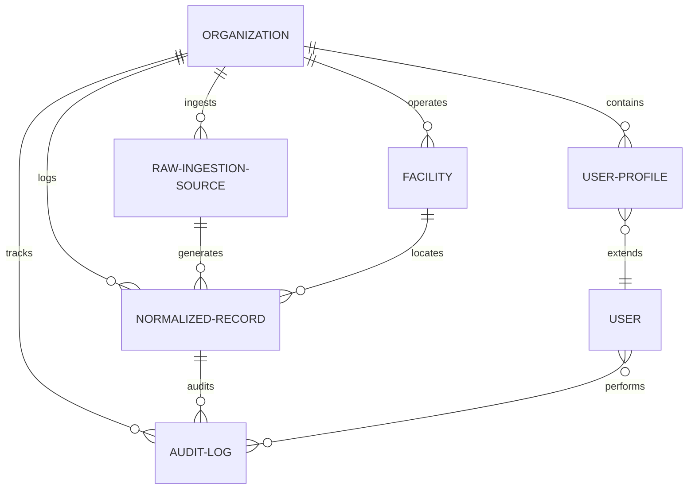

# Data Model & Architecture (MODEL.md)

This document describes the database design of the Breathe ESG Ingestion and Normalization Platform. The schema is optimized for audit readiness, strict data integrity, multi-tenant security, and accurate temporal allocation.

---

## 1. Entity Relationship Overview

The platform uses a relational schema designed to store raw, un-altered source payloads and trace them directly to normalized carbon entries.

---

## 2. Model Specifications

### 2.1 Tenant Isolation & Security
To ensure strict multi-tenancy:
- Every tenant is represented by an `Organization`.
- The `UserProfile` model extends Django’s built-in `User` and binds each login to an `Organization`.
- Major database tables (`Facility`, `RawIngestionSource`, `NormalizedRecord`, `AuditLog`) maintain a direct Foreign Key to `Organization`.
- **Query Isolation Policy:** All API endpoints automatically append a `.filter(organization_id=org_id)` filter based on the active user’s organization context.

### 2.2 Source-of-Truth Tracking
Auditors require a strict lineage from the final CO2 calculation back to the raw file that produced it.
- **`RawIngestionSource`** acts as our vault. It stores:
  - `raw_payload`: The complete un-altered string of the CSV/pipe-delimited file or JSON API response.
  - `filename` and `ingested_at`.
- **`NormalizedRecord`** references `RawIngestionSource` via a Foreign Key (`raw_source_id`).
- Under the reviewer modal, the frontend shows the raw payload line and the parsed normalized values side-by-side. If a value is questioned, the analyst can trace it back to the exact character sequence in the source file.

### 2.3 Scope 1/2/3 Categorization
We separate carbon activities according to the Greenhouse Gas Protocol:
- **Scope 1 (Direct)**: Stationary combustion fuels (Diesel, Gasoline, Heating Oil) from SAP files.
- **Scope 2 (Indirect)**: Electricity usage from Utility meters.
- **Scope 3 (Supply Chain / Value Chain)**:
  - Category 1 (Purchased Goods and Services): Procurement spend parsed from SAP.
  - Category 6 (Business Travel): Flights, hotels, and ground transport parsed from travel JSON payloads.

---

## 3. Database Schema Definitions

### 3.1 `Organization`
*Tenant identifier.*
* `id` (BigInt, PK)
* `name` (VarChar, 255)
* `created_at` (DateTime)

### 3.2 `UserProfile`
*Extends standard Django Auth User to map user roles.*
* `id` (BigInt, PK)
* `user_id` (FK to auth.User, Cascade)
* `organization_id` (FK to Organization, Cascade)
* `role` (VarChar, 20) — `ANALYST`, `ADMIN`, or `AUDITOR`

### 3.3 `Facility`
*Physical company assets (manufacturing plants, offices, datacenters).*
* `id` (BigInt, PK)
* `organization_id` (FK to Organization, Cascade)
* `facility_code` (VarChar, 100) — Matches `WERKS` in SAP or Meter Numbers in Utility portals.
* `name` (VarChar, 255)
* `location` (VarChar, 100) — e.g. "DE" or "US"
* `grid_subregion` (VarChar, 100) — e.g. "CAMX" or "ERCOT"
* *Constraint*: Unique together `(organization, facility_code)`.

### 3.4 `IataAirport`
*System reference table for calculating Great Circle distances.*
* `iata_code` (VarChar, 3, PK)
* `latitude` (Decimal, 9, 6)
* `longitude` (Decimal, 9, 6)
* `city` (VarChar, 255)
* `country` (VarChar, 100)

### 3.5 `EmissionFactor`
*Reference factors for greenhouse gas calculations.*
* `id` (BigInt, PK)
* `organization_id` (FK to Organization, Nullable) — Custom client factors if provided; null means standard system default.
* `scope` (Integer) — 1, 2, or 3
* `category` (VarChar, 100) — e.g., "Purchased Electricity"
* `activity_type` (VarChar, 150) — e.g., "Electricity - Grid" or "Diesel"
* `factor_value` (Decimal, 12, 6) — Tonnes CO2e per unit
* `factor_unit` (VarChar, 50) — e.g., "tCO2e/kWh" or "tCO2e/L"
* `source` (VarChar, 255) — e.g., "US EPA eGRID 2025"
* `year` (Integer)

### 3.6 `RawIngestionSource`
*Archive of raw files/API calls.*
* `id` (BigInt, PK)
* `organization_id` (FK to Organization)
* `source_type` (VarChar, 20) — `SAP`, `UTILITY`, or `TRAVEL`
* `filename` (VarChar, 255)
* `raw_payload` (TextField) — Complete raw file contents or JSON response
* `ingested_at` (DateTime)
* `ingested_by_id` (FK to auth.User, Nullable)
* `status` (VarChar, 20) — `SUCCESS`, `FAILED`, or `PARTIAL`
* `processing_logs` (TextField) — Processing metrics (lines parsed, warnings)

### 3.7 `NormalizedRecord`
*The ledger storing parsed, normalized, and validated carbon activities.*
* `id` (BigInt, PK)
* `organization_id` (FK to Organization)
* `raw_source_id` (FK to RawIngestionSource)
* `facility_id` (FK to Facility, Nullable)
* `scope` (Integer)
* `category` (VarChar, 100)
* `activity_type` (VarChar, 150)
* `activity_date` (Date) — Date of the activity (or the pro-rated calendar day)
* `original_quantity` (Decimal, 15, 4)
* `original_unit` (VarChar, 50)
* `normalized_quantity` (Decimal, 15, 4)
* `normalized_unit` (VarChar, 50)
* `emission_factor_value` (Decimal, 12, 6)
* `emission_factor_unit` (VarChar, 50)
* `emissions_tco2e` (Decimal, 15, 6) — Normalized Quantity * Factor Value
* `status` (VarChar, 20) — `PENDING_REVIEW`, `APPROVED`, `REJECTED`, `SUSPICIOUS`, or `FAILED`
* `anomalies` (TextField) — Comma-separated list of flags (e.g. "Negative quantity", "Facility not mapped")
* `is_locked` (Boolean) — True once approved. Blocks edits.
* `reviewed_by_id` (FK to auth.User, Nullable)
* `reviewed_at` (DateTime, Nullable)
* `is_edited` (Boolean) — True if modified by an analyst.
* `comments` (TextField)

### 3.8 `AuditLog`
*SOX-compliant change ledger.*
* `id` (BigInt, PK)
* `organization_id` (FK to Organization)
* `record_id` (FK to NormalizedRecord)
* `user_id` (FK to auth.User, Nullable) — Creator of the change (Null if system-ingested)
* `timestamp` (DateTime)
* `action` (VarChar, 20) — `INGEST`, `EDIT`, `APPROVE`, or `REJECT`
* `old_values` (JSONField) — Key-value dictionary of values before execution (null for INGEST)
* `new_values` (JSONField) — Key-value dictionary of values after execution
* `change_reason` (TextField) — Required string explanation for manual edits

---

## 4. Normalization and Pro-Rating Algorithms

### 4.1 Temporal Pro-Rating (Utility Electricity)
Utility bills do not respect calendar months. If a bill runs from October 15 to November 13 (30 days) and registers 3,000 kWh:
1. The parser calculates the total billing days: $N = \text{End Date} - \text{Start Date} + 1 = 30 \text{ days}$.
2. It calculates the daily usage: $U_{\text{daily}} = \frac{3,000}{30} = 100 \text{ kWh/day}$.
3. It spawns $30$ separate `NormalizedRecord` entries, one for each date between Oct 15 and Nov 13.
4. For each day, it performs an emissions calculation: $E = 100 \text{ kWh} \times \text{Factor}_{\text{grid}}$.
This pro-rating guarantees that if an analyst pulls a report for "November 2025", the system accounts for exactly 13 days of this bill (1,300 kWh) rather than either ignoring the bill entirely or dumping all 3,000 kWh in one month.

### 4.2 Distance Calculation (Flights)
For travel records with missing distance metrics:
1. The parser reads `origin` (e.g., `SFO`) and `destination` (e.g., `JFK`).
2. It queries `IataAirport` coordinates:
   - SFO: $(37.6213, -122.3790)$
   - JFK: $(40.6398, -73.7789)$
3. It computes the Great Circle distance in kilometers using the Haversine formula:
   $$\Delta \text{lat} = \text{lat}_2 - \text{lat}_1$$
   $$\Delta \text{lon} = \text{lon}_2 - \text{lon}_1$$
   $$a = \sin^2\left(\frac{\Delta \text{lat}}{2}\right) + \cos(\text{lat}_1)\cos(\text{lat}_2)\sin^2\left(\frac{\Delta \text{lon}}{2}\right)$$
   $$d = 2 \times 6371.0 \times \arcsin(\sqrt{a})$$
4. It maps the calculated distance ($d = 4,161.4 \text{ km}$) to a haul length (Long Haul, >3,700km) and applies the corresponding factor.
